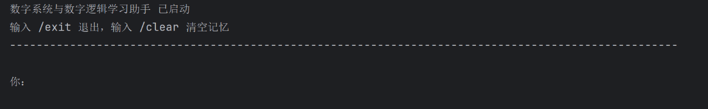
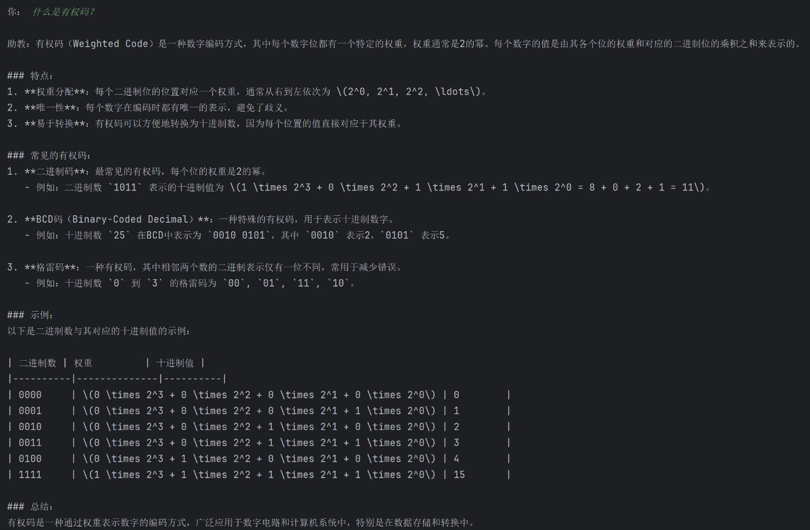
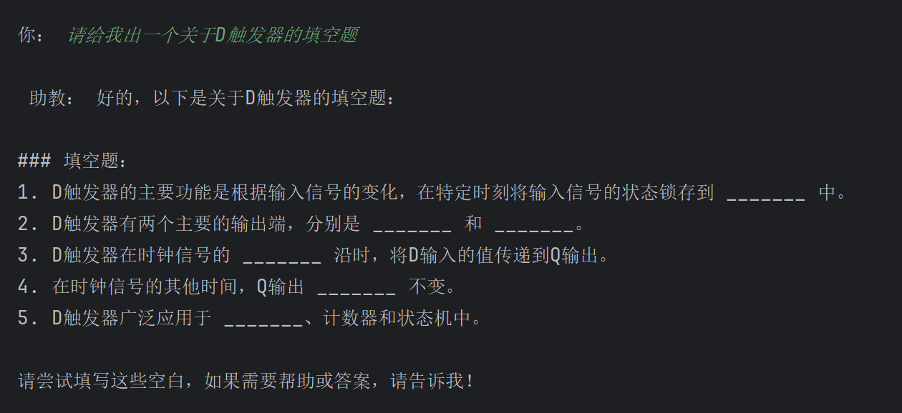
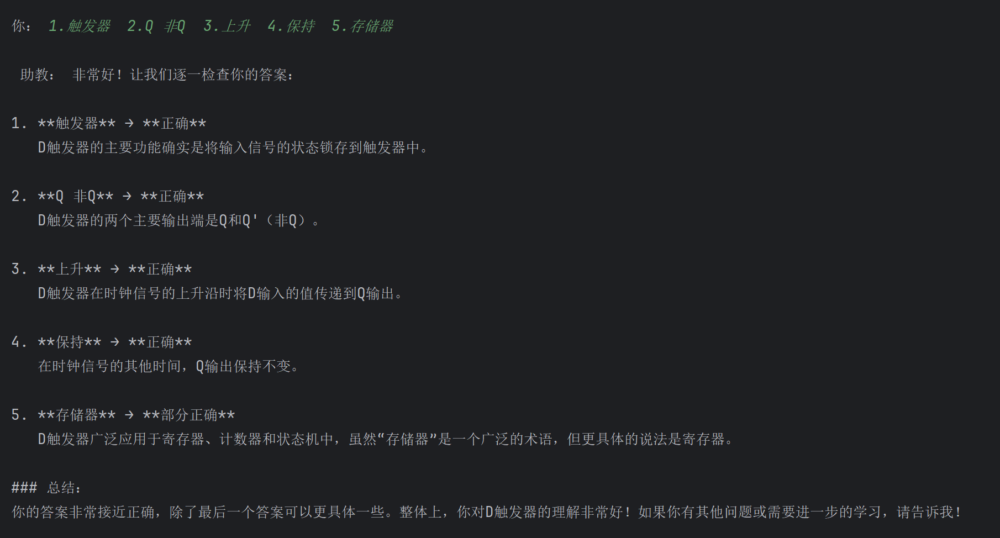
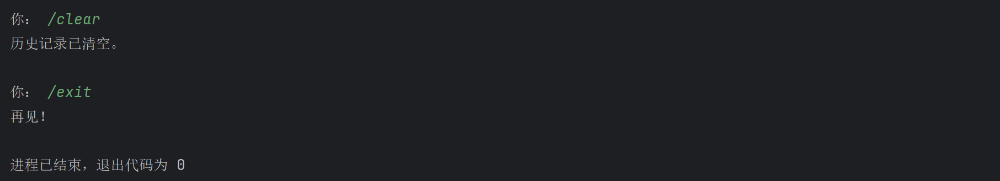
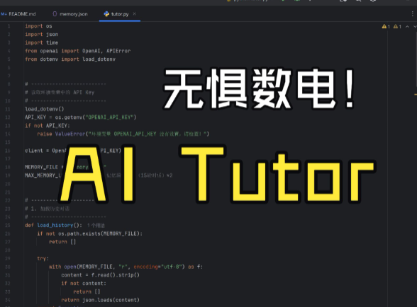

# Digital Logic Tutor

一个基于 OpenAI API 的“数字系统与数字逻辑”智能学习助手。


## 功能介绍

* 概念讲解（自动附带 ASCII / Mermaid 电路图）
* 例题解析与推导
* 自动生成练习题（选择 / 填空 / 简答 / 设计题）
* 检查答案并指出错误原因
* 多轮对话记忆（滑动窗口）
* 对话记录本地持久化
* 流式输出、自动重试、健壮性更高
* 助教逻辑封装为类，结构更清晰


## 运行环境

* Python 3.10+
* pip（Python 包管理器）
* OpenAI API Key（需自行申请）


## 安装与运行

### 1. 克隆项目

```
git clone http://github.com/Griney-code/Digital-Logic-Tutor
```

### 2. 安装依赖

```
pip install -r requirements.txt
```

### 3. 配置环境变量

在项目根目录创建 `.env`：

```
OPENAI_API_KEY=你的API密钥
```

⚠️ 不要把 `.env` 上传到 GitHub。


## 启动应用

```
python tutor.py
```

运行后你将看到：

```
数字系统与数字逻辑学习助手 已启动
输入 /exit 退出，输入 /clear 清空记忆
```


## 文件结构

```
digital_logic_tutor/
│── tutor.py           # 主程序（AI 助教类 + 流式输出 + 记忆管理）
│── memory.json        # 自动生成的历史记录
│── .env               # 环境变量（手动创建）
│── requirements.txt
│── README.md
│── .gitignore
│── images
```


## 使用说明

* 正常提问
  “请解释组合逻辑与时序逻辑的区别”
* 要例题
  “请给我一个关于触发器的练习题并讲解过程”
* 要检查答案
  “我认为上一题的答案是...”
* 清空历史
  `/clear`
* 退出
  `/exit`


## 运行示例

### 开始运行


### 概念提问


### 例题练习


### 检查答案


### 清空历史记录 退出


### 演示视频
[](https://www.bilibili.com/video/BV1DzmTBdEWi/?vd_source=b757728ab3398657f735706c7dd45dbf)


## 注意事项

* 若 memory.json 过大，程序会自动清理早期历史
* API Key 必须放在环境变量，不可写入代码
* 需要联网


